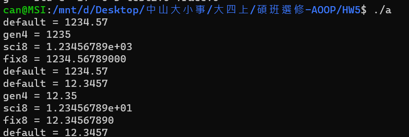
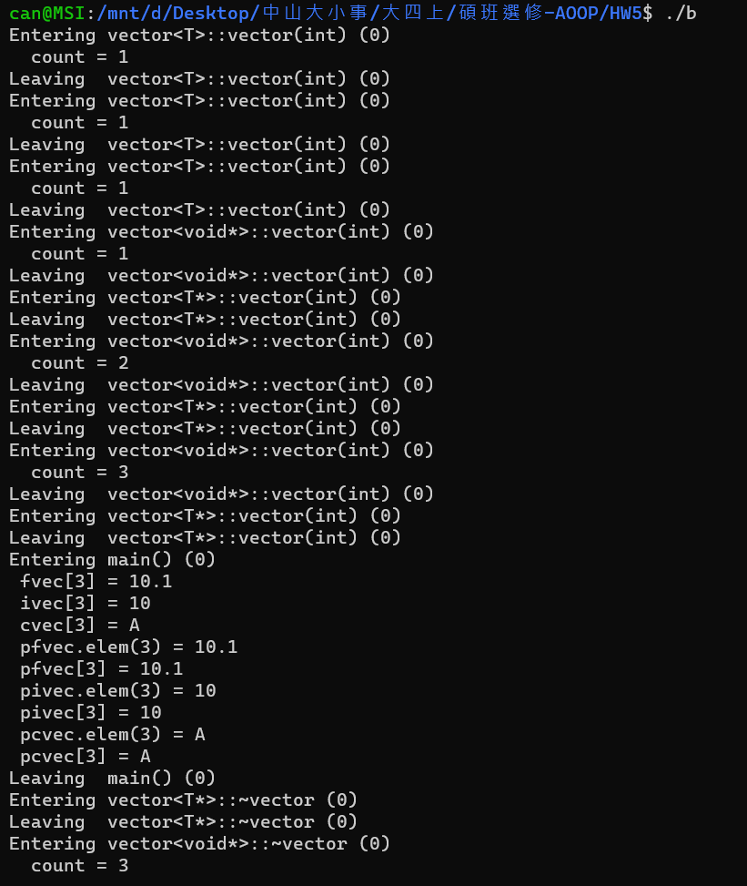

<h1> Homework Assignment #5 </h1>
<h2> Program description </h2>
<h3>Part I (50%)</h3>
    

    This assignment requires that you complete the implementation of the user-defined manipulators as given in
    Section 21.4.6.3 of the book entitled The C++ Programming Language, Special Edition by Bjarne Stroustrup.
    The test program and the output of the test program are as given in Listing 1 and Listing 2. In order to make it
    easier for you to integrate your program with the test program, as given in Listing 1, you are required to name
    your program Form.h.
    

<h5>EX: </h5>
    
<h3>Part II (50%)</h3>
    

    This assignment requires that you complete the implementation of the class template hierarchy as given in Section
    13.5 of the book entitled The C++ Programming Language, Special Edition by Bjarne Stroustrup.
    The test program and the output of the test program are as given in Listing 3 and Listing 4. In order to make it
    easier for you to integrate your program with the test program, as given in Listing 3, you are required to name
    your program Vector.h.
    

<h5>EX: </h5>
    

<h2>Build </h2>
    <ol>
        <li> <code>make</code> </li>
        <li> 
<code>./a </code>  </li>
        <li> 
<code>./b </code>  </li>
        <li> <code>make clean</code> </li>
    </ol>
